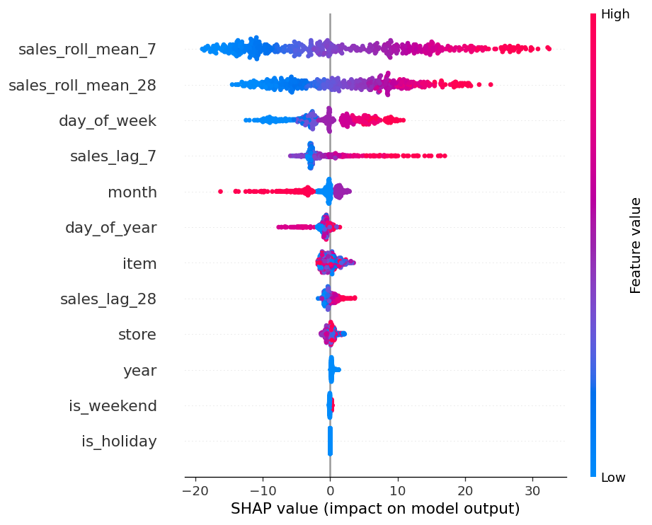
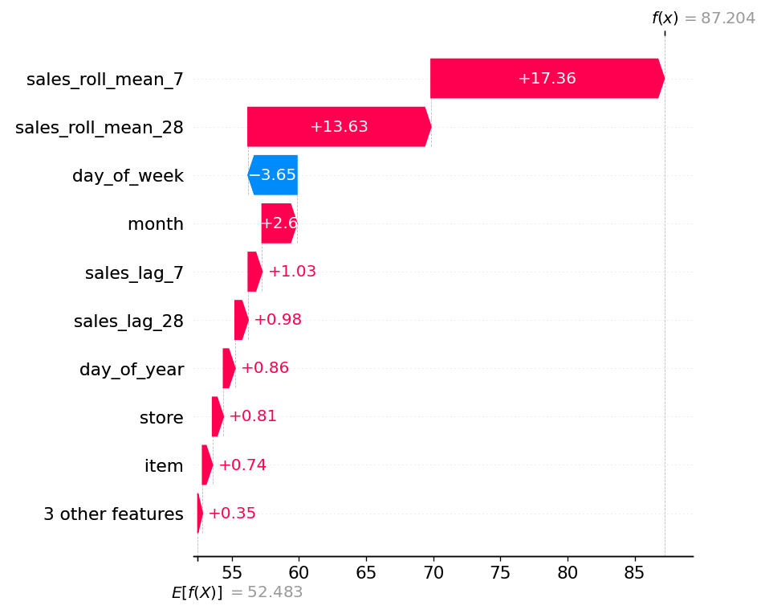
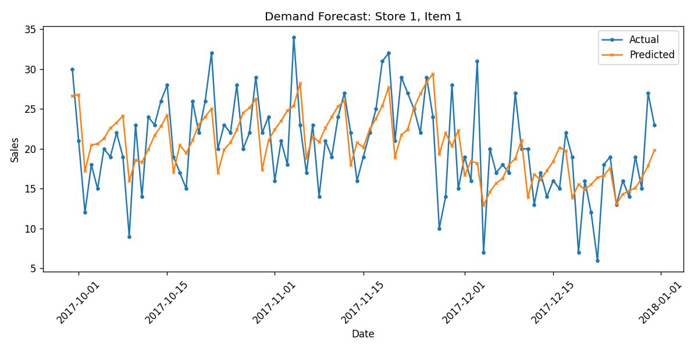

# Demand Forecasting with Explainability (SHAP + LightGBM)

## Overview
This project forecasts daily product demand for store-item combinations and uses
SHAP (SHapley Additive exPlanations) to explain *why* the model makes each prediction —
going beyond a black-box accuracy number to interpretable, feature-level insights.

## Problem Statement
Retailers need accurate demand forecasts to manage inventory, avoid stockouts/overstock,
and plan promotions. Beyond accuracy, **understanding which factors drive demand**
(recent sales trends, seasonality, holidays, day-of-week effects) is critical for
business decision-making — this is where explainability becomes essential.

## Dataset
**Kaggle "Store Item Demand Forecasting Challenge"**
- ~899,000 rows
- 10 stores × 50 items
- Daily sales data from 2013-01-01 to 2017-12-31

## Approach

### 1. Feature Engineering
- Date features: day of week, month, year, day of year, is_weekend
- Holiday flag: derived using the `holidays` library (US holidays)
- Lag features: sales 7 and 28 days ago
- Rolling averages: 7-day and 28-day rolling mean of past sales

### 2. Model
- **LightGBM Regressor**, trained on a time-based train/test split to avoid data leakage:
  - Train: 2013-01-29 to 2017-09-29 (852,500 rows)
  - Test: 2017-09-30 to 2017-12-31 (46,500 rows)

### 3. Evaluation
| Metric | Value  |
|--------|--------|
| RMSE   | 7.80   |
| MAPE   | 13.10% |

### 4. Explainability (SHAP)

**Global feature importance** (mean |SHAP value| across test samples):
1. `sales_roll_mean_7` — by far the most important feature
2. `sales_roll_mean_28` — second most important
3. `day_of_week`
4. `month`
5. `sales_lag_7`, `sales_lag_28`, `day_of_year`, `store`, `item` — smaller contributions

This confirms **strong short-term autocorrelation**: a store-item's recent sales level
(especially the last 7 days) is the single best predictor of its near-future sales —
more important than which store or item it is.

**Per-prediction example** (see `outputs/shap_waterfall_example.png`):
- Base (average) prediction: **52.48 units**
- For this specific store-item-day, predicted: **87.20 units**
- Why? `sales_roll_mean_7` (+17.36) and `sales_roll_mean_28` (+13.63) were the dominant
  drivers — this item has been selling well above average recently, so the model
  expects that trend to continue. `day_of_week` (-3.65) slightly pulled the prediction
  down, as this particular day tends to have lower sales than the weekly average.





### 5. Deployment
A FastAPI service (`app.py`) exposes a `/predict` endpoint that returns:
- Predicted demand
- Base (average) prediction
- Top 3 features driving this specific prediction (via SHAP)

**Example request/response:**
```json
// Request
{
  "store": 1, "item": 1, "is_holiday": 0,
  "day_of_week": 5, "month": 12, "year": 2017,
  "is_weekend": 1, "day_of_year": 350,
  "sales_lag_7": 60, "sales_lag_28": 55,
  "sales_roll_mean_7": 58, "sales_roll_mean_28": 56
}

// Response
{
  "predicted_sales": 57.83,
  "base_value": 52.48,
  "top_3_factors": [
    {"feature": "day_of_week", "contribution": 5.38},
    {"feature": "month", "contribution": -4.04},
    {"feature": "sales_roll_mean_7", "contribution": 3.82}
  ]
}
```

## How to Run
```bash
pip install -r requirements.txt

cd src
python feature_engineering.py
python train_model.py
python shap_analysis.py
python plot_predictions.py

cd ..
uvicorn app:app --reload
# Visit http://127.0.0.1:8000/docs
```

## Key Takeaways
- Recent sales momentum (7-day and 28-day rolling averages) dominates the forecast —
  short-term demand is highly autocorrelated, more so than store/item identity itself.
- Day-of-week and month effects are meaningful secondary drivers.
- SHAP transforms the model from a black box into a tool business stakeholders can
  trust, interrogate, and use to justify inventory decisions.

## Future Improvements
- Incorporate external features like weather and promotional calendars
- Experiment with hierarchical forecasting (store-level, item-level, total)
- Add confidence intervals to predictions